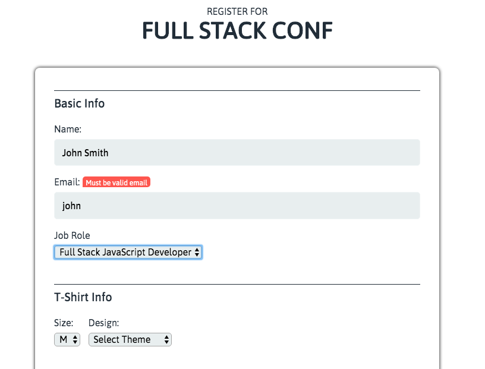

# Interactive Form

> Interactive registration form enhanced with JavaScript & jQuery.

## Features

* Validating user input only with JavaScript
* Form validation messages
* Form provides error messages in real time
* Form provides error message that changes depending on the error (email)

## Technologies

* JavaScript
* jQuery 3.4.0
* CSS
* HTML

## Demo

Active demo: [Interactive Form](https://annes99.github.io/Interactive-Form/)

## Screenshot

## Status

Project is: _completed_

## Inspiration

Treehouse Techdegree: FSJS project 3 - Interactive Form

## Contact

Created by [@Annes](https://twitter.com/annesCode)
